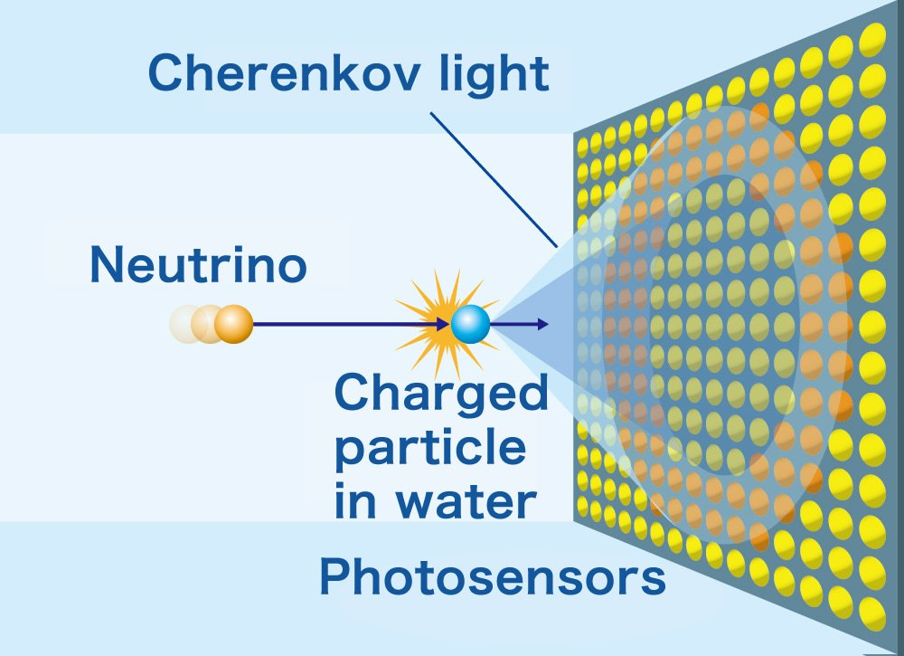
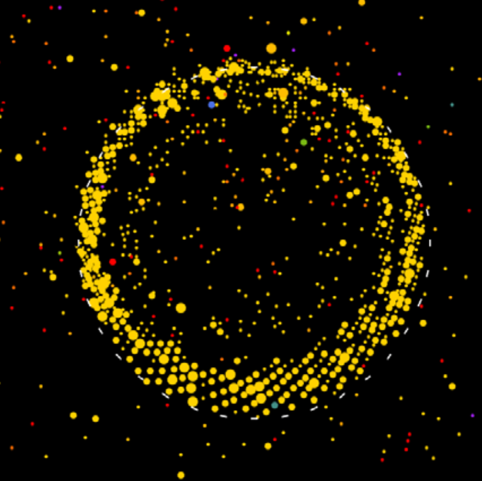

This repository contains tutorial material and exercises made for A3Net AI/ML school in Osaka 2024.

# Context [Introduction]
-----------------------------

Cherenkov light is emitted when a particle travels faster than the speed of light in the medium.
Cherenkov light forms a well understood geometrical pattern, consisting of a collection of light cones with vertices on the track trajectory.

Most Neutrino Telescopes are made of water. When the particle is ultra-relativistic, the Cherenkov angle (cone opening angle is ~42 degrees.
Water Cherenkov detectors allow to study neutrinos with great precision on an event-by-event basis.

Two main detector concepts exist: One using photosensors on the surfaces of a large strucutre sourrounding a big volume of water (Kamioknade, Super-Kamiokande, Hyper-Kamiokande...), the other using an  array of string (IceCube, KM3NET...), with the former focussed on low and intermediate energies [MeV-GeV] and the latter dedicated to intermediate and high energies[GeV-TeV]

In this tutorials we will focus on AI/ML tools in the context of images similar to those in Super-Kamiokande.

<table>
  <tr>
    <td></td>
    <td></td>
    <td></td>
  </tr>
</table>

This is an example on how a $\nu_\mu$ interactions looks in Super-Kamiokande.

This type of Neutrino Telescopes have been crucial in forming our current understanding of Astrophysics.
A collection of references you might read to deepen in this topic:

* First Detection of Supernova Neutrinos ('<a href="https://journals.aps.org/prd/pdf/10.1103/PhysRevD.38.448">Phys.Rev.D 38 (1988) 448-458</a>')
* Studying the Sun with Neutrinos ('<a href="https://arxiv.org/abs/2312.12907">Phys.Rev.D 109 (2024) 9, 092001</a>')
* Studying Neurino Oscillations with Atmospheric Neutrinos ('<a href="https://arxiv.org/abs/2311.05105">Phys.Rev.D 109 (2024) 7, 072014</a>')
* Measuring Matter-Antimatter Asymmetry in Neutrino Oscillations ('<a href="https://arxiv.org/abs/1910.03887">Nature 580 (2020) 7803, 339-344</a>')

To understand how AI/ML can assist to tasks related to the science being researched with this type of detectors, we can create simple datasets that resemble their data without having to deal with the nuisances that would require dealing with the actual data from these detectors.

-----------------------------

# Repository Summary [Introduction]
The material consists of:
1) A notebook (RingClassifier) with code to generate datasets consisting of images with N rings (1 or 2 by default), code to read them, and a list of exercises to be made with that dataset.
2) A notebook (MNISTClassifier) to show how one can perform classification on the MNIST (hand written numbers) dataset using a simple CNN, which is formatted in the exact same way as the datasets that are generated for this project. This is an introductory notebook meant to illustrate how to solve the main task in the RingClassifier notebook. The MNIST dataset does not need to be downloaded, it is readily available via tf.keras.datasets.mnist.load_data().
3) A notebook (RingRegressor)  with code to create a dataset consisting of images with a single ring and associated labels with information about its underlyinf parameters (center X and Y, thickness, radius and distortion). There is also code showing how to load images from the dataset and a list of exercises to be performed with the dataset. I also provide image examples of how the solutions might look like, and plotting functions to compare the performances.
4) A notebook (RingGenerator) that works with the same dataset as the RingRegressor, but this time focuses on generating new rings. I propose exercises, and show an image of how a succesful RingGenerator code solution might look like.
